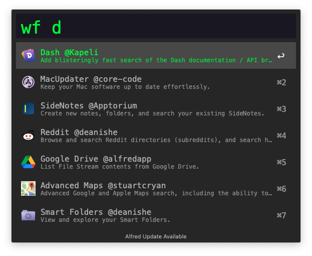
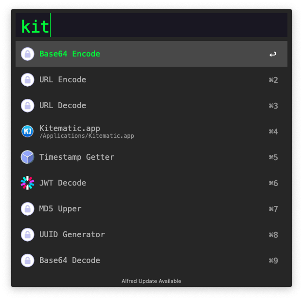

#  AWPark
Alfred Workflow for engineer.

## Alfred Workflow Store
Search and install [Workflows.json](/static/workflows.json)

Default keyword: [**wf**]

* Input [Enter] : Download & Install; (Open workflow's website if url is empty)
* Input [Cmd + Enter] : Open workflow's website.

## Develop Kit
Default keyword: [**kit**]

Features:

* Base64 Encode/Decode.
* URL Encode/Decode.
* MD5 Lower/Upper.
* Show IP Address.
* Timestamp Getter/Formatter.
* UUID Generator.
* JWT Decode.